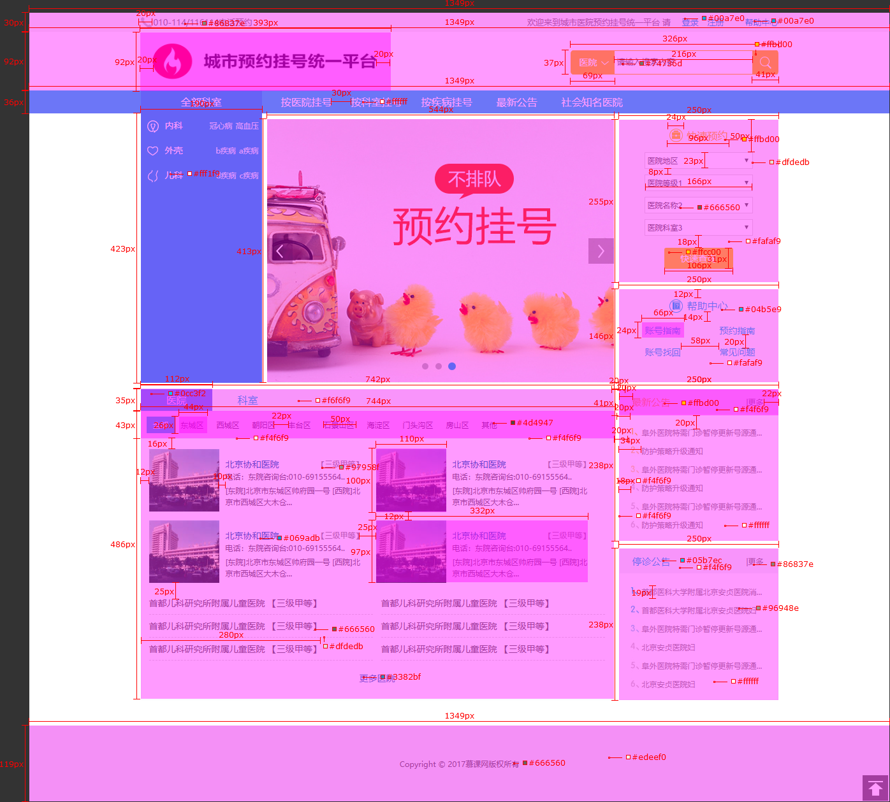
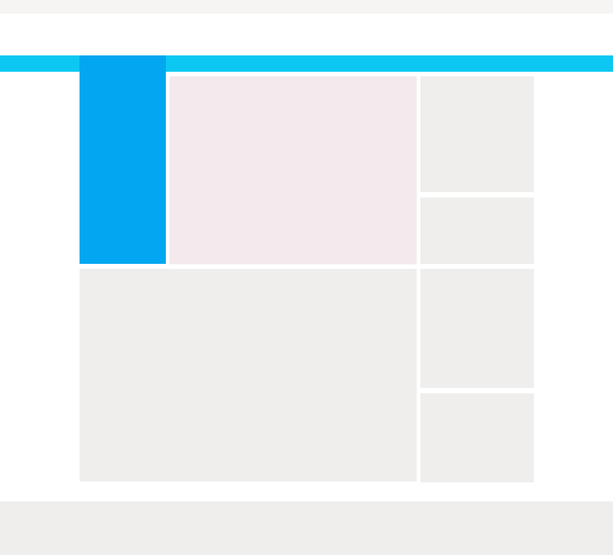
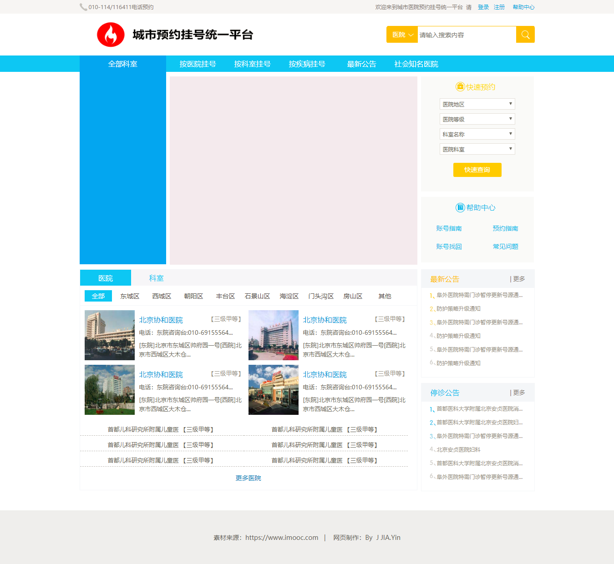
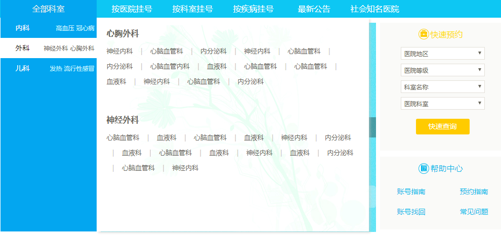

# JIANGJIAYin.github.io
<html>
<head>
  <meta charset="utf-8">
</head>
<body>
  

    
最终样式：

    
  

  
细节：

  

    
划分区域：

    
  

  

    
布局：

    
  

  

    
基础样式：

    
  

  
交互效果：

  

    
  

  

    
  

</body>
</html>
